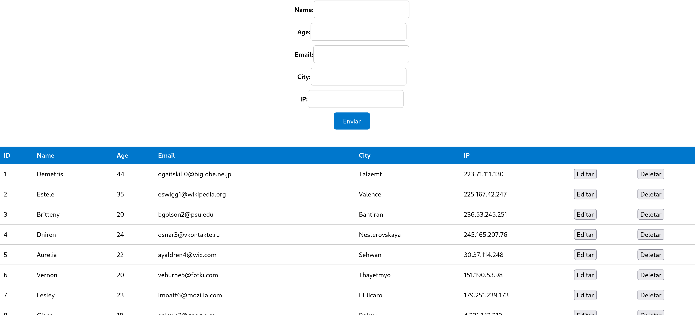

## Docker Compose Aplicação Web

### Aplicação React com um Back-end Python (Flask) e um banco de dados PostgreSql

Estrutura do projeto:
```
.
├── api
│   ├── Dockerfile
│   ├── app.py
│   ...
├── db
│   └── users
|   └── tables
|     ...
├── compose.yaml
├── frontend
│   ├── ...
│   └── Dockerfile
└── README.md
```

### Documentação da API Flask:

Esta é uma API para gerenciamento de usuários.

#### Endpoint `/users`

### GET
- Retorna todos os usuários cadastrados na base de dados.
```
[
    {
        "id": 1,
        "name": "João",
        "age": 30,
        "email": "joao@email.com",
        "city": "São Paulo",
        "ip": "192.168.0.1"
    },
    {
        "id": 2,
        "name": "Maria",
        "age": 25,
        "email": "maria@email.com",
        "city": "Rio de Janeiro",
        "ip": "192.168.0.2"
    },
    ...
]
```

### POST
 - Adiciona um novo usuário na base de dados.

Exemplo de corpo da requisição:
```
{
"name": "João da Silva",
"age": 30,
"email": "joao.silva@gmail.com",
"city": "São Paulo",
"ip": "192.168.0.1"
}
```


### PUT /users/`:id`
 - Atualiza os dados de um usuário já cadastrado.

 Exemplo de corpo da requisição:
```
{
"name": "João da Silva",
"age": 35,
"email": "joao.silva@gmail.com",
"city": "Rio de Janeiro",
"ip": "192.168.0.1"
}
```

### DELETE /users/`:id`

- Este endpoint permite excluir um usuário existente com base no ID fornecido.


- utilizamos no geral imagens leves:`postgre:alpine` `node:14-alpine`  `python:3.9-slim-buster`
[_compose.yaml_](compose.yaml)
```
services:
   api:
    build: ./api
    ports:
      - 8000:8000
    ...
  db:
    #Usamos uma imagem postgres:alpine por ser bem leve e pratica
    image: postgres:alpine
    ports:
      - "5432:5432"
    volumes:
      - ./postgres/init.sql:/docker-entrypoint-initdb.d/init.sql
      - ./postgres/data:/var/lib/postgresql/data
    ...
  frontend:
    build: ./frontend
    ports:
    - 3000:3000
    ...
```
O arquivo "docker-compose.yml" define um aplicativo com três serviços `frontend`, `backend` e `db`.
Ao implantar o aplicativo, o docker compose mapeia a porta 3000 do contêiner de serviço de front-end para a porta 3000 do host, conforme especificado no arquivo.
Certifique-se de que a porta 3000 no host não esteja em uso.


## Deploy

```
$ docker-compose up -d --build

```

## Resultado esperado após o comando acima
```
Building api
[+] Building 11.6s (10/10) FINISHED
 => [internal] load .dockerignore
 => [internal] load metadata for docker.io/library/python:3.9-slim-buster
 => [1/5] FROM docker.io/library/python:3.9-slim-buster
...

Building frontend
[+] Building 84.6s (12/12) FINISHED
 => [internal] load .dockerignore
 => [internal] load metadata for docker.io/library/node:14-alpine
...
```

A listando os contêineres em execução e o mapeamento de portas conforme abaixo:
```
$ docker ps
CONTAINER ID   IMAGE                         COMMAND                  CREATED         STATUS         PORTS                                       NAMES
63b6189ecb50   projeto-final-ckp2_frontend   "docker-entrypoint.s…"   3 minutes ago   Up 3 minutes   0.0.0.0:3000->3000/tcp, :::3000->3000/tcp   projeto-final-ckp2_frontend_1
cfbed175c549   projeto-final-ckp2_api        "python app.py"          3 minutes ago   Up 3 minutes   0.0.0.0:8000->8000/tcp, :::8000->8000/tcp   projeto-final-ckp2_api_1
634304d52168   postgres:alpine               "docker-entrypoint.s…"   3 minutes ago   Up 3 minutes   0.0.0.0:5432->5432/tcp, :::5432->5432/tcp   projeto-final-ckp2_db_1

```

Depois que o aplicativo iniciar, navegue até `http://localhost:3000` em seu navegador da web.




O contêiner de serviço de back-end(api) tem a porta 8000 mapeada para o host.
```
$ curl http://localhost:8000/users
[
  {
    "age": 44,
    "city": "Talzemt",
    "email": "dgaitskill0@biglobe.ne.jp",
    "id": 1,
    "ip": "223.71.111.130",
    "name": "Demetris"
  },
  {
    "age": 35,
    "city": "Valence",
    "email": "eswigg1@wikipedia.org",
    "id": 2,
    "ip": "225.167.42.247",
    "name": "Estele"
  }]

```

Interromper os containers
```
$ docker compose down

```
